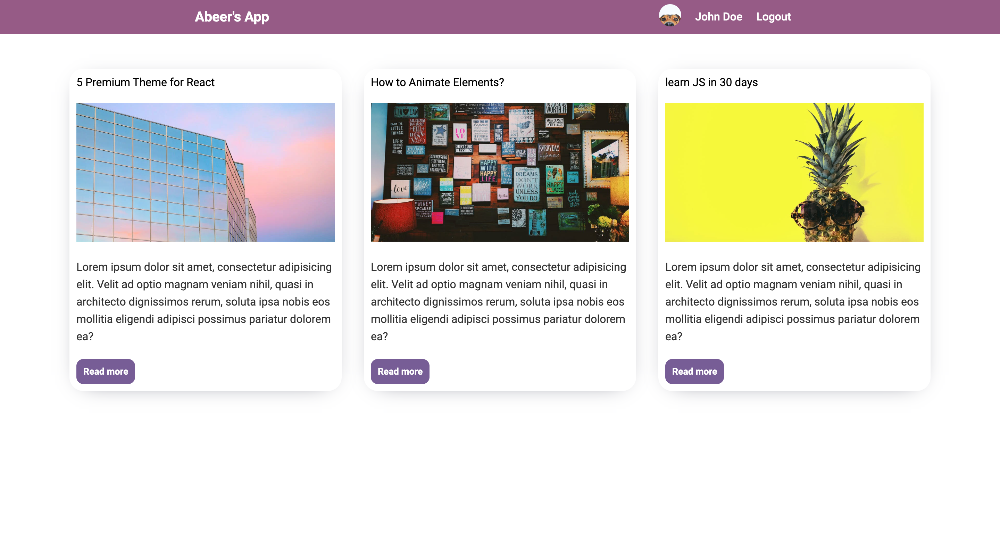
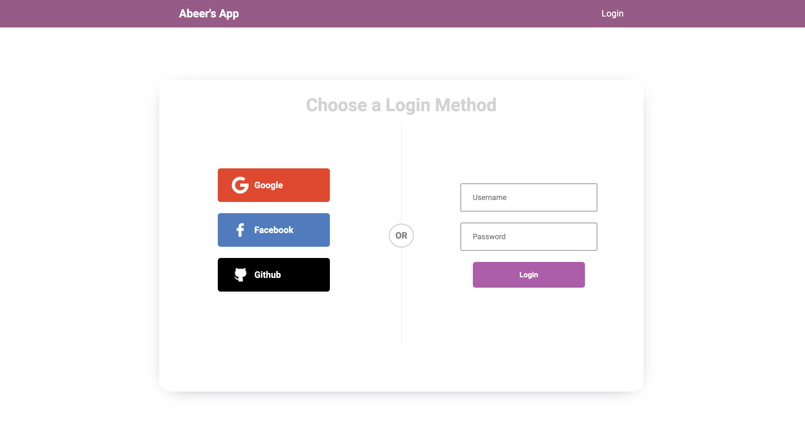
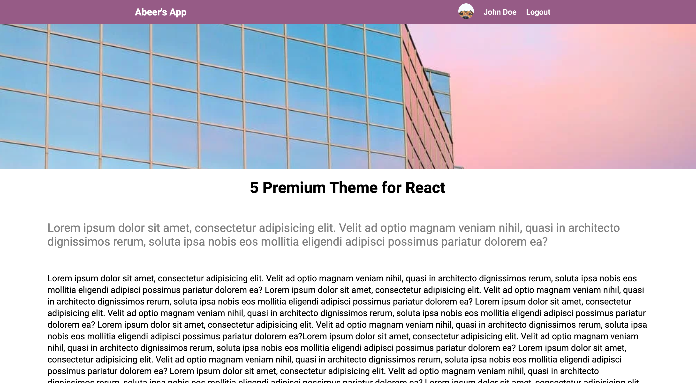
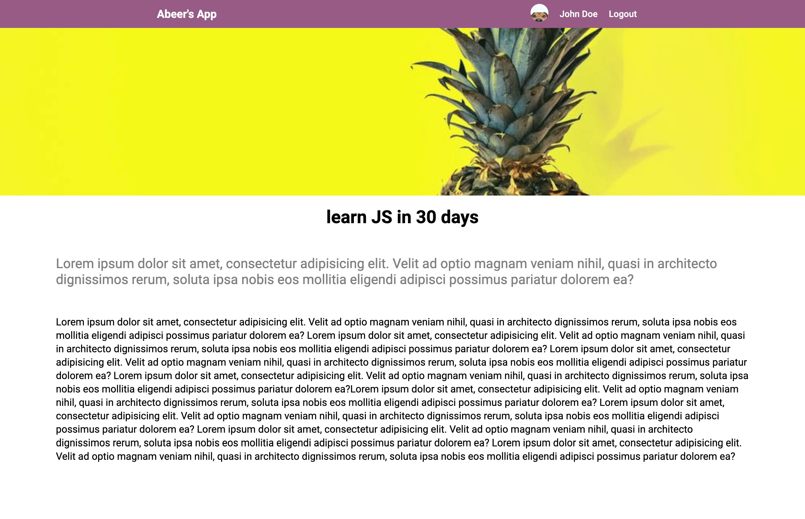

# Social Page Login
Link to project deployed with netlify. Live demo [here](https://main--social-login-page.netlify.app/)

## Table of Content
* General Information
* Technologies Used
* Features
* Screenshot
* Installation and Setup Instructions
* Usage
* Project Status
* Room for Improvement
* Acknowledgements
* Contact

## General Information
I created this social login page to practice authentication using Passport.JS, Cors, Cookie-Session, Express, Nodemen, Node.JS, React-Router-Dom, and React Hooks.

### Purpose of this project
To practice authentication, web design, and routing.

## Technologies Used
* ReactJS
* HTML
* CSS
* JavaScript
* React Hooks
* Cors
* Passport.JS
* Express
* Nodemen
* Node.JS
* Cookie-Session
* React-Router-Dom

## Features
#### Note: To see all featured pages mentioned below go to: app.js/:10 and toggle the user variable between true and false.
* React-routing.
* A Home page.
* A Login page => to access add: /login (if user = true you'll see the home page otherwise you'll see the login page.)
* A Posts page => to access add: /Posts/1 or 2 or 3 (the three post pages are visible if user = true only; otherwise you will be directed to home.)
* A dynamic logo button. 
* A dynamic profile button.
* A dynamic navbar.

## Screenshot
Home Page - Logged In

Home Page - Logged Out

Login Page 

Post Page - 1

Post Page - 2

Post Page - 3

## Installation and Setup Instructions

Clone down this repository. You will need node and `npm` installed globally on your machine.

### Installation:

`npm install`

To Run Test Suite:

`npm test`

To Start Server:

`npm start`

To Visit App:

`localhost:3000/`

## Usage

**Home Page**

* The home page carries a preview of the posts, if the user value (see app.js line 10) then clicking on the post will take you there, otherwise you will be directed to the login page.

**Login Page**

* the login page uses Passport.JS to allow the usage of google, facebook, and github to login.

**Posts page**

* The posts page displays the full posts. There are 3 different post pages.

**Dynamic Navbar**

* The navbar components change depending on the user status (see screenshots hompe page logged in/out.)

**Dynamic Logo**

* The logo button will direct you to the home page.

**Dynamic Profile Button**

* The profile button will direct you to the home page.

**URL Routing**

* To access all website pages look URL extensions in features.

## Project Status
Project is: Incomplete

## Room for Improvement
* Finish the authentication.

## Acknowledgements
* Many thanks to LamaDev.

## Contact
Created by Abeer Ahmed [LinkedIn profile](add url) - feel free to contact me.

